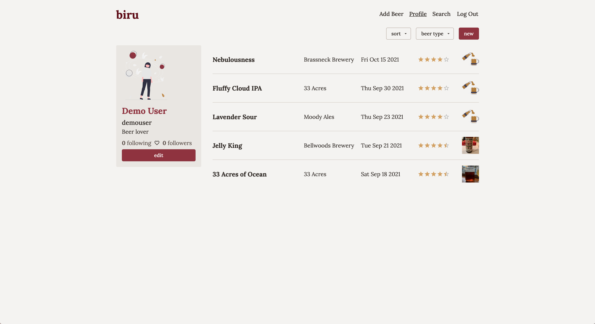

# biru

biru is a full stack beer journal web app. You can try biru out [here](https://journal.biru.cool).



The front end is implemented on top of Next.js. User authentication state is stored globally using React context, and a higher order component (HOC) handles redirects when a user visits a page that they do not have permission to see. When a user that isn't authenticated visits the site, they are redirected to the login page. After logging in, they are redirected to the home page, where they are shown a feed of beers added by users they follow. The profile page contains the user's information, along with the beers that they've added. A user can add and edit beers, as well as edit their profile. They can add an image for each beer and to their profile. Users can search for others by username, visit their profile and follow them. The UI was developed with a mobile-first approach and is fully. responsive.

The back end is an Express application, and PostgreSQL is the relational database used for storing data. The Sequelize object relational mapper (ORM) is used to mediate interactions with the server and to define schemas. Session-based authentication is used, with Passport.js as the middleware for handling incoming requests. Images uploaded on the front end are sent to the server, where they are then uploaded to Cloudinary.

Working on this personal project gave me valuable experience with relational databases and ORMs, as well as different user authentication architectures. This was my first time working with sessions and cookies, and I learned a lot through the development and deployment process (which involved many dreaded cors issues). Overall, this project greatly improved my understanding of and skills in server-side programming. I also improved my front end skills, as using httpOnly cookies for authorization requires more complex management tools than token-based authentication systems, because httpOnly cookies aren't accessible by client-side Javascript. I originally read session tokens on the Next.js server in `getServerSideProps`, which enables server-side rendering, but ultimately chose a static generation method, showing a loading screen until the authentication status is determined through an API call.

## Repo structure

The `server` subdirectory contains the code for the back end application, and the `client` subdirectory contains the code for the front end application.

## Dependencies

Data is stored in a [PostgreSQL](https://www.postgresql.org/) database. [Cloudinary](https://cloudinary.com/) is used for managing image uploads and storage. The deployed server and client-side applications are hosted separately on [Heroku](https://www.heroku.com/).

### Server

- `express`: web application framework
- `express-session`: session management middleware for authentication
- `cors`: middleware for enabling cross-origin requests
- `dotenv`: loads environment variables
- `pg`: modules for interacting with Postgres databases
- `sequelize`: ORM package
- `passport`: authentication middleware
- `passport-local`: strategy for authenticating with username and password
- `bcrypt`: library for hashing passwords
- `connect-session-sequelize`: sequelize session store
- `pg-hstore`: serializes and deserializes JSON data (required for using `pg` with `connect-session-sequelize`)
- `cloudinary`: SDK for managing cloudinary API calls
- `multer`: middleware for handing form data in requests
- `morgan`: request logging
- `http-status-codes`: constants for HTTP status codes

### Client

- `next`: producion `react` framework with static and server side rendering, pre-fetching, etc.
- `react`: UI library
- `react-dom`: DOM-specific methods for `react`
- `sass`: css preprocessor
- `axios`: HTTP client for making requests to the server
- `react-easy-crop`: component for cropping images
- `@mui/material`: component library
- `@mui/icons-material`: icon library
- `react-icons`: icon library
- `@emotion/react`: required for MUI css styles 
- `@emotion/styled`: required for MUI styled components

## Running locally

### Server

Enter the `server` subdirectory:

```bash
cd server
```

Several environment variables must be configured in order to run the back end application. You must have a [PostgreSQL](https://www.postgresql.org/) user and host configured on your local machine, a [Cloudinary](https://cloudinary.com/) account and a session secret for `express-session`. Create a file called `.env` with the following contents:

```bash
PORT=3001

POSTGRES_HOST_DEV="your postgres host"
POSTGRES_USER_DEV="your postgers user"
POSTGRES_PASSWORD_DEV="your postgres user password"

SESSION_SECRET="your session secret"

CLOUDINARY_CLOUD_NAME="your cloudinary cloud name"
CLOUDINARY_API_KEY="your cloudinary API key"
CLOUDINARY_API_SECRET="your cloudinary API secret"
```

Now, the app can be started:

```bash
npm run dev
```

The app will be listening on http://localhost:3001.

### Client

Enter the client subdirectory and run the app in development mode:

```bash
cd client
npm run dev
```

Open http://localhost:3000 with your browser to see the result.
